## 《Reinforcement learning and game theory》

original code: https://gitee.com/goluke/dqn-breakout
you can also view it at my Gitee https://gitee.com/zhuang-yangyang/reinforcement-learning-and-game-theory.git

## 1. Introduction

### 1.1 How to play a Breakout game:

- A player is given a paddle that it can move horizontally
- At the beginning of each turn, a ball drops down automatically from somewhere in the screen*
- The paddle can be used to bounce back the ball
- There are layers of bricks in the upper part of the screen
- The player is awarded to destroy as many bricks as possible by hitting the bricks with the bouncy ball
- The player is given 5 turns in each game


### 1.2 How to solve the Breakout game:

Original solution is natural DQN.

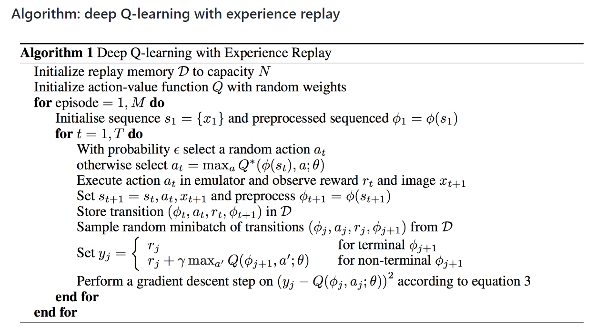it can be divided into 3 layers structurally.

- The first layer. We initialize a `replay memory` $D$ whose maximum capacity is $N$. It is set to store the information of `transition`$(\phi(s), a, r, \phi(s'))$ that collected for each step. And then we initialize a deep neural network $Q$ with random numbers. Next, we do M times `Episode`, let the robot keep playing games inside until beat the game or game over.

- The second layer. We initialize a sequence $s$ in each `Episode`, and then preprocess it, which is used to construct input. Next, we start a $T$ times cycle, process a step each time.

- The third and most important layer, which defines what we do in each step.

  - Firstly, we select a action $a_t$ using $\epsilon-greedy$ algorithm which is the same as we used in Q-Learning algorithm last time.

  - Secondly, we execute action $a_t$ and get reward and observation information, and store `transition`$(\phi_t, a_t, r_t, \phi_{t+1})$ in $D$.

  - Thirdly, we randomly choose some `transitions` from $D$ and calculate $y_j$ with
    $$
    y_j= 
    \left\{
    	\begin{array}{**lr**}
    	r_j & \phi_{j+1} \ is\  done\\
    	r_j+\gamma max_{a'}Q(\phi_{j+1},a';\theta) & \phi_{j+1}\ is \ not\ done
    	\end{array}
    \right.
    $$

  - Finally, we calculate $Loss = (y_i - Q(\phi_j,a;\theta))^2$ and update all the parameters of the $Q$ network by gradient back propagation of the neural network.

    ​

This is the simplest DQN with no decoration, which is not enough to train a great DQN model. So we have to add some decorations.

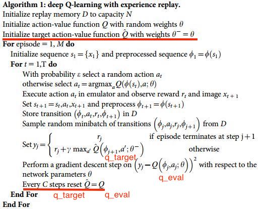

we replace the params of target network with current network's. It's important that both model have totally identical NN structure, and what we have to do is to assign the value of each parameters in current network into target network. 

And we update the parameters of target network as the parameters of main metwork for each  target_update steps. 


## 2. Original Code

### 2.1 Hyperparameter

```python
GAMMA = 0.99 # discount factor
GLOBAL_SEED = 0 # 
MEM_SIZE = 100_000 # a seed for random.seed( )
RENDER = True
SAVE_PREFIX = "./models"
STACK_SIZE = 4

EPS_START = 1.
EPS_END = 0.1
EPS_DECAY = 1000000

BATCH_SIZE = 32 # Number of data for one training
POLICY_UPDATE = 4 # the frequency of updating policy network
TARGET_UPDATE = 10_000 # the frequency of updating target network
WARM_STEPS = 50_000 # the number of warming steps
MAX_STEPS = 25_000_000 # total learning step
EVALUATE_FREQ = 100_000 # the frequency of updating network parameters
```

#### e-greedy exploration

eps will gradually decrease as loop_time increases

```python
# from utils_drl.py
self.__eps -= (self.__eps_start - self.__eps_final) / self.__eps_decay
self.__eps = max(self.__eps, self.__eps_final)
```

#### Optimizer: optim.Adam

- learning rate: 0.0000625
- Epsilon: 1.5e-4

```python
# from utils_drl.py
self.__optimizer = optim.Adam(
  self.__policy.parameters(),
  lr=0.0000625,
  eps=1.5e-4,
)
```


### 2.2 Main_Loop

```python
for step in progressive:
    if done:
        observations, _, _ = env.reset()
        for obs in observations:
            obs_queue.append(obs)

    training = len(memory) > WARM_STEPS
    state = env.make_state(obs_queue).to(device).float()
    action = agent.run(state, training)
    obs, reward, done = env.step(action)
    obs_queue.append(obs)
    memory.push(env.make_folded_state(obs_queue), action, reward, done)

    if step % POLICY_UPDATE == 0 and training:
        agent.learn(memory, BATCH_SIZE)

    if step % TARGET_UPDATE == 0:
        agent.sync()

    if step % EVALUATE_FREQ == 0:
        avg_reward, frames = env.evaluate(obs_queue, agent, render=RENDER)
        with open("rewards.txt", "a") as fp:
            fp.write(f"{step//EVALUATE_FREQ:3d} {step:8d} {avg_reward:.1f}\n")
        if RENDER:
            prefix = f"eval_{step//EVALUATE_FREQ:03d}"
            os.mkdir(prefix)
            for ind, frame in enumerate(frames):
                with open(os.path.join(prefix, f"{ind:06d}.png"), "wb") as fp:
                    frame.save(fp, format="png")
        agent.save(os.path.join(
            SAVE_PREFIX, f"model_{step//EVALUATE_FREQ:03d}"))
        done = True
```

- Firstly, we check whether the game is over, if over then reset the game and add the observation to the obs_queue.
- Next, we get the state and action depended on obs_queue,and we use the action to call function env.step and get the `obs, reward, done`, then we push `obs_queue, action, reward, done` into the memory.
- Finally, we decide whether to update the network, policy network and target network parameters by th value of step


### 2.3 Net_Model

We write the Net_Model in the `utils_model.py`, we have drawn the network structure as follows:

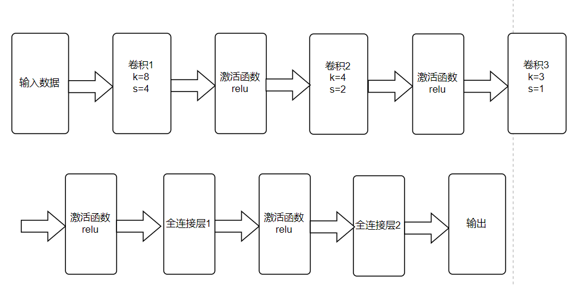

and we would have a function to init weights as follow:

```python
def init_weights(module):
	if isinstance(module, nn.Linear):
		torch.nn.init.kaiming_normal_(module.weight, nonlinearity="relu")
		module.bias.data.fill_(0.0)
	elif isinstance(module, nn.Conv2d):
		torch.nn.init.kaiming_normal_(module.weight, nonlinearity="relu")
```

we can see how to use the function torch.nn.init.kaiming_normal on this website:

[torch.nn.init.kaiming_normal](https://blog.csdn.net/weixin_36670529/article/details/101776253)


### 2.4 ReplayMemory

We write the Net_Model in the `utils_memory.py`, We mentioned above that we need a memory tool to memorize `obs_queue, action, reward, done`. So we need the class ReplayMemory.

Firstly, we will have a function push

```python
def push(
        self,
        folded_state: TensorStack5,
        action: int,
        reward: int,
        done: bool,
    ) -> None:
  
    self.__m_states[self.__pos] = folded_state
    self.__m_actions[self.__pos, 0] = action
    self.__m_rewards[self.__pos, 0] = reward
    self.__m_dones[self.__pos, 0] = done

    self.__pos += 1
    self.__size = max(self.__size, self.__pos)
    self.__pos %= self.__capacity
```

we just define `self.__m_states,self.__m_actions, self.__m_rewards, self.__m_dones` like the array, and we use pos as the index to find what we need, and when pos == capacity, it means that the memory tool is full, and it works as a queue. (First In First Out) 


### 2.5 Agent

We write the Agent in the `utils_drl.py`. It mainly includes four behaviors of the agent. 

Firstly, the function run() decides an action based on the current state by epsilon-greedy policy.  It will get a random action or get an action from memory depending on the size of the relationship between eps and the random number.

```python
def run(self, state: TensorStack4, training: bool = False, testing: bool = False) -> int:
    """run suggests an action for the given state."""
    if training:
        self.__eps -= (self.__eps_start - self.__eps_final) / self.__eps_decay
        self.__eps = max(self.__eps, self.__eps_final)

    if testing or self.__r.random() > self.__eps:
        with torch.no_grad():
            return self.__policy(state).max(1).indices.item()
    return self.__r.randint(0, self.__action_dim - 1)
```


Secondly, the function learn() obtain information from the experience pool by randomly sampling in order to update the parameters in the policy network. 

```python
def learn(self, memory: ReplayMemory, batch_size: int) -> float:
    """learn trains the value network via TD-learning."""
    state_batch, action_batch, reward_batch, next_batch, done_batch = memory.sample(batch_size)

    values = self.__policy(state_batch.float()).gather(1, action_batch)
    values_next = self.__target(next_batch.float()).max(1).values.detach()
    expected = (self.__gamma * values_next.unsqueeze(1)) * (1. - done_batch) + reward_batch
    loss = F.smooth_l1_loss(values, expected)

    self.__optimizer.zero_grad()
    loss.backward()
    for param in self.__policy.parameters():
        param.grad.data.clamp_(-1, 1)
    self.__optimizer.step()

    return loss.item()
```

- we use function `self.__policy` (The evaluation network) for computing value and we use function `self.__target` (The target network) for computing target.

  the game is over when done_batch = 1 and expected = reward_batch

  the game is not over when done_batch = 0 and expected = reward_batch + self.__gamma * values_next.unsqueeze(1)


- Then, we call function `self.__optimizer.zero_grad()` to initialize gradient to zero and call function `loss.backward()` to reverse propagation gradient


- Finally, we call function `self.__optimizer.step()` to update all parameters.


Thirdly, we call function `sync()` synchronizes the weights from the policy network to the target network. 

```python
def sync(self) -> None:
    """sync synchronizes the weights from the policy network to the target
    network."""
    self.__target.load_state_dict(self.__policy.state_dict())

```

Fourthly, we call function `save()` save the structure and parameters of policy network.

```python
def save(self, path: str) -> None:
    """save saves the state dict of the policy network."""
    torch.save(self.__policy.state_dict(), path)
```


### 2.6 Env

We write the Env in the `utils_env.py`.  Various tool functions are implemented here such as getting a frame of the current state and getting the definition of each actions. There are many static functions and three main function.

`reset`

```python
def reset(
        self,
        render: bool = False,
) -> Tuple[List[TensorObs], float, List[GymImg]]:
    """reset resets and initializes the underlying gym environment."""
    self.__env.reset()
    init_reward = 0.
    observations = []
    frames = []
    for _ in range(5): # no-op
        obs, reward, done = self.step(0)
        observations.append(obs)
        init_reward += reward
        if done:
            return self.reset(render)
        if render:
            frames.append(self.get_frame())

    return observations, init_reward, frames
```

setting the agent to the initial position and  5 steps to give an observation of the beginning environment. 


`step`

```python
def step(self, action: int) -> Tuple[TensorObs, int, bool]:
    """step forwards an action to the environment and returns the newest
    observation, the reward, and an bool value indicating whether the
    episode is terminated."""
    action = action + 1 if not action == 0 else 0
    obs, reward, done, _ = self.__env.step(action)
    return self.to_tensor(obs), reward, done
```

It receive the action number and execute it then return the next state, its rewards and the information of wheter the game is done. 


`evaluate`

```python
def evaluate(
            self,
            obs_queue: deque,
            agent: Agent,
            num_episode: int = 3,
            render: bool = False,
    ) -> Tuple[
        float,
        List[GymImg],
    ]:
        """evaluate uses the given agent to run the game for a few episodes and
        returns the average reward and the captured frames."""
        self.__env = self.__env_eval
        ep_rewards = []
        frames = []
        for _ in range(self.get_eval_lives() * num_episode):
            observations, ep_reward, _frames = self.reset(render=render)
            for obs in observations:
                obs_queue.append(obs)
            if render:
                frames.extend(_frames)
            done = False

            while not done:
                state = self.make_state(obs_queue).to(self.__device).float()
                action = agent.run(state, testing=True)
                obs, reward, done = self.step(action)

                ep_reward += reward
                obs_queue.append(obs)
                if render:
                    frames.append(self.get_frame())

            ep_rewards.append(ep_reward)

        self.__env = self.__env_train
        return np.sum(ep_rewards) / num_episode, frames
```

We have 5 lives to play the game, and in the 5 * num_episode loop, we will reset the environment when we game over one time. And while the game is not over, we will loop the state and action, and we get the obs_queue and reward. Finally we can get the average rewards. 


### 2.7 Result

we use the reward.txt to draw a jpg as follow:

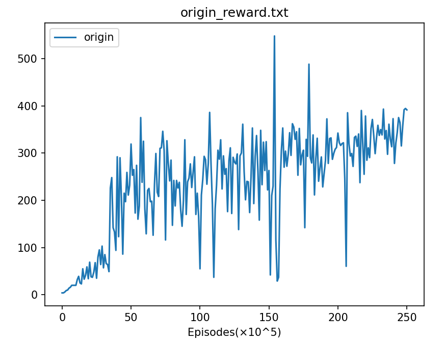

We run the display.ipynb and we can get another picture:
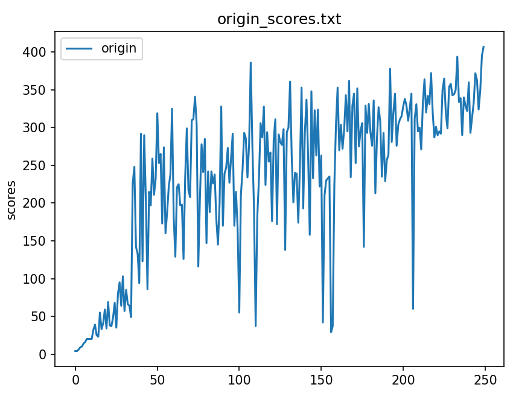

We can see that when model>50, most of the model can get a high score, but none of the model can win the game, we will provide the video to show the best result (model 249). 


### 2.8 Game Loop

There maybe be a game loop and the game will never end, so we need to give a judge:

```python
start = time.time()
while not done:
    state = self.make_state(obs_queue).to(self.__device).float()
    action = agent.run(state, testing=True)
    obs, reward, done = self.step(action)

    ep_reward += reward
    obs_queue.append(obs)
    if render:
        frames.append(self.get_frame())
    end = time.time()
    if end - start > 15:
        done = True
        print("Force To End")
```

the game loop example will be given in a video.


## 3. Improvements of DQN

### 3.1 Dueling DQN

#### 3.1.1 The Dueling Network Architecture

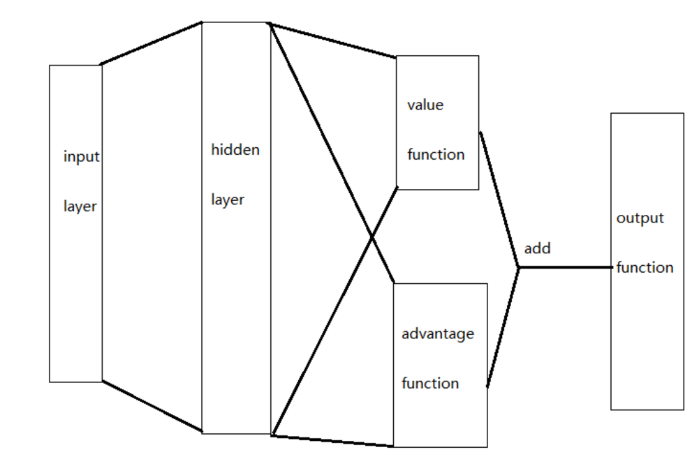

In Dueling DQN, we add two sub network structures, which correspond to the price function network part and the advantage function network part of the above figure.

It can be seen from the above that Dueling DQN divides Q function into state function and advantage function, so there are:
$$
Q(s, a;\theta,\alpha,\beta) = V(s;\theta,\beta) + A(s,a;\theta,\alpha) \tag1
$$
In the formula, $V(s;\theta,\beta)$ is the state function, outputting a scalar, $A(s,a;\theta,\alpha)$ is the advantage function, outputting a vector whose length is equal to the size of the action space; $\theta$ refers to the parameters of the network roll up layer; $\alpha$ and $\beta$ are the parameters of the full connection layer of the two branches respectively.

Formula (1) has the problem of uniqueness, that is, V and A cannot be uniquely separated from Q. For example, if a constant is added to V and subtracted from A, Dueling DQN will still output the same Q value. This unidentifiable problem will seriously reduce network performance. That is, V cannot reflect the state value, and A can not reflect the advantage value.

How to make V reflect the state value to solve the problem of unidentifiable? We change the formula as follow:
$$
Q(s, a;\theta,\alpha,\beta) = V(s;\theta,\beta) + (A(s,a;\theta,\alpha)-\frac{1}{\mathcal{A}}\sum_{a'\in|\mathcal{A}|} A(s,a';\theta,\alpha)) \tag2
$$

#### 3.1.2 Dueling DQN Theoretical Basis

Why we add two sub network structures and decompose Q?

- Through such decomposition, not only the $q$ value of a given state and action can be obtained, but also the $v$ value and $A$ value can be obtained simultaneously. In this way, if you need to use the $v$ value in some scenes, you can also obtain the $v$ value without training a network.
- By explicitly giving the output value of the $v$ function, each update will explicitly update the $v$ function, so that the update frequency of the $v$ function will be deterministically increased.
- For some reinforcement learning problems, the value range of $A$ is much smaller than the value of $v$, so it is easier to keep the sequence of actions by training them separately. As the value range of $A$ is relatively small, it is more sensitive to model updating, so that the model will be easier to consider the relative changes with other actions when updating, and the original order of actions will not be accidentally broken due to a certain update.


#### 3.1.3 Dueling DQN Model Modify

```python
    def __init__(self, action_dim, device):
        super(DQN, self).__init__()
        self.__conv1 = nn.Conv2d(4, 32, kernel_size=8, stride=4, bias=False)
        self.__conv2 = nn.Conv2d(32, 64, kernel_size=4, stride=2, bias=False)
        self.__conv3 = nn.Conv2d(64, 64, kernel_size=3, stride=1, bias=False)
        self.__fc1_a = nn.Linear(64*7*7, 512)
        self.__fc1_v = nn.Linear(64*7*7, 512)
        self.__fc2_a = nn.Linear(512, action_dim)
        self.__fc2_v = nn.Linear(512, 1)
        self.__device = device
        self.actionsDim = action_dim

    def forward(self, x):
        x = x / 255.
        x = F.relu(self.__conv1(x))
        x = F.relu(self.__conv2(x))
        x = F.relu(self.__conv3(x))
        a = F.relu(self.__fc1_a(x.view(x.size(0), -1)))
        a = self.__fc2_a(a)
        v = F.relu(self.__fc1_v(x.view(x.size(0), -1)))
        v = self.__fc2_v(v).expand(x.size(0), self.actionsDim)
        res = v + a - a.mean(1).unsqueeze(1).expand(x.size(0), self.actionsDim)
        return res
```

Just modify the network structure according to Formula 2, and we konw that Dueling DQN divides Q function into state function and advantage function.


#### 3.1.4 Result

we use the reward.txt to draw a jpg as follow:

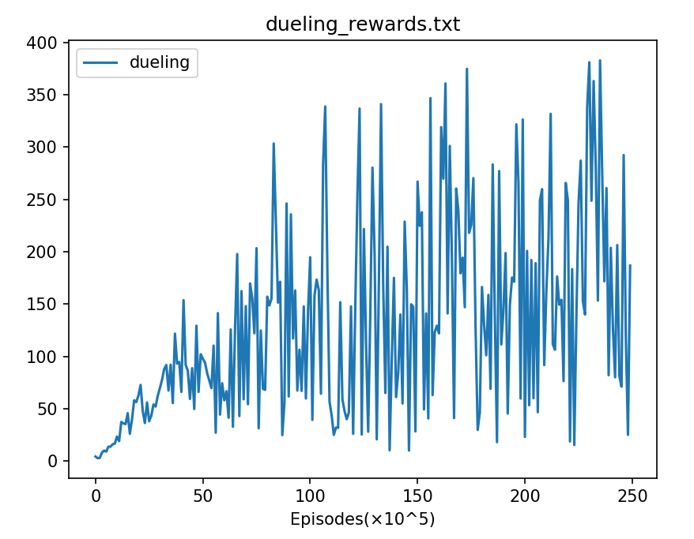

We run the display.ipynb and we can get another picture:
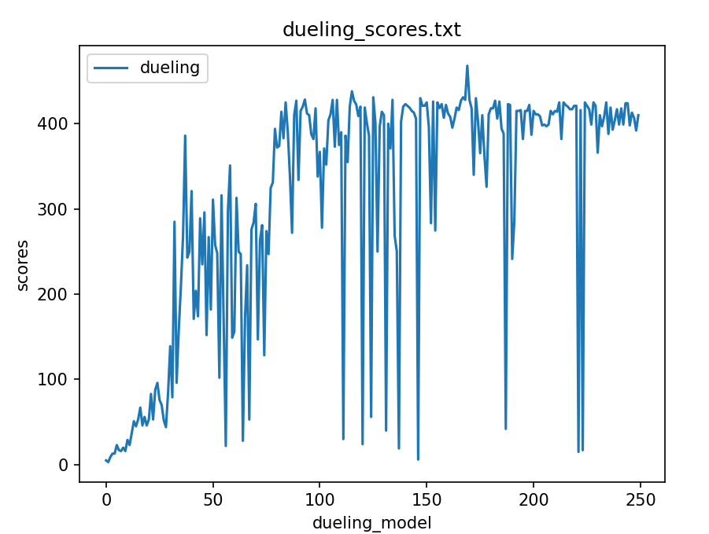

We can see that when model>100, most of the model can get a high score, and some of the model can win the game, we will provide the video to show the result. One game can get 432 scores most, and dueling dqn can get 468 (model 169)


### 3.2 Double DQN

#### 3.2.1 Overestimating Q-Values

Q-Learning has a pervasive issue of overestimating the Q-values, this is a result of using the same network to pick the successor action greedily and give the value of the successor action. This means if there’s a small positive error in the Q-value estimate, this overestimate will be transferred to the preceding state’s Q-values too.

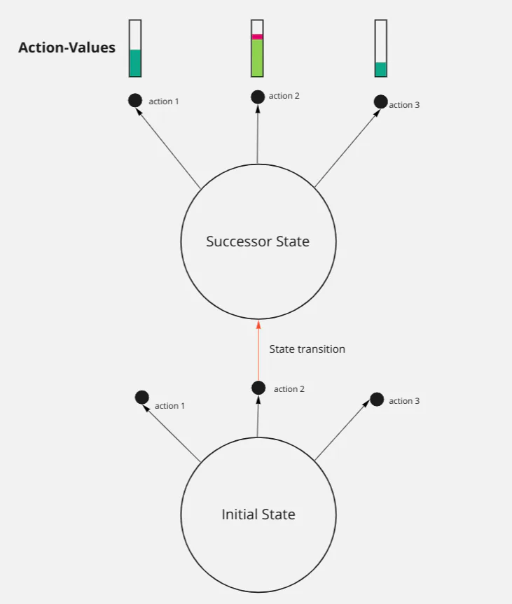

> The best successor state value is the Q-value for action 2. If there’s a positive error (shown in red), the update for the initial state is an overestimate.

During learning, it’s normal for value estimates to be imprecise, meaning that overestimations are common.

If these overestimations of Q-values were uniform across the states, then this wouldn’t be an issue. The policy resulting from the Q-values would be the same as for the true Q-values, since all would be increased by a similar amount.


#### 3.2.2 Solution is Double DQN

Double DQN refers to the fact that you use a 2nd deep neural network.

It decomposes the \maxmax operation in the training target into 2 parts: action selection & action evaluation.

Quick reminder of the training target:
$$
\text{Q-Learning Target} = r_{t+1} + \gamma q(s_{t+1}, \underset{a'}{argmax} q(s_{t+1}, a'))
$$
**Action selection** selects the action to be used in the target:

 
$$
a_{selected} = \underset{a'}{argmax }{\,}q(s_{t+1}, a')
$$
Double DQN uses the current network being trained for action selection. It uses a ‘target network’ for the action evaluation. The target network is usually an old version of the network being trained. Typically they update the target network to match the current network roughly every 10 episodes, but it becomes out of date as soon as the current network is updated.

In summary, the Double-DQN training target becomes:
$$
\text{Double Q-Learning Target} = r_{t+1} + \gamma *q{_{target}}(s_{t+1}, \underset{a'}{argmax }{\,}q(s_{t+1}, a'))
$$

#### 3.2.3 Q-Target Modify

We update the code as follow:

```python
values = self.__policy(state_batch.float()).gather(1, action_batch)
# values_next = self.__target(next_batch.float()).max(1).values.detach()
# expected = (self.__gamma * values_next.unsqueeze(1)) * (1. - done_batch) + reward_batch
max_action = self.__policy(next_batch.float()).max(1)[1].view(-1, 1)
max_next_q_values = self.__target(next_batch.float()).gather(1, max_action)
expected_Q_values = (self.__gamma * max_next_q_values) * (1. - done_batch) + reward_batch
```


#### 3.2.4 Result

we use the reward.txt to draw a jpg as follow:

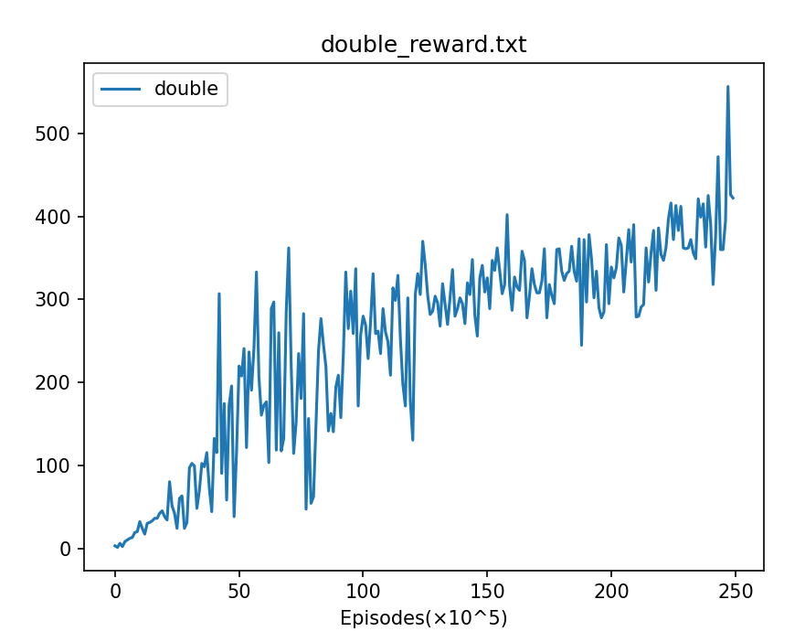

We run the display.ipynb and we can get another picture:
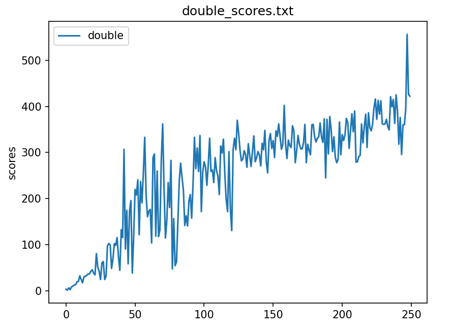

We can see that when model>50, most of the model can get a high score, but not so high, and just one of the model can win the game, we will provide the video to show the best result (model 247). 


## 4. Compare

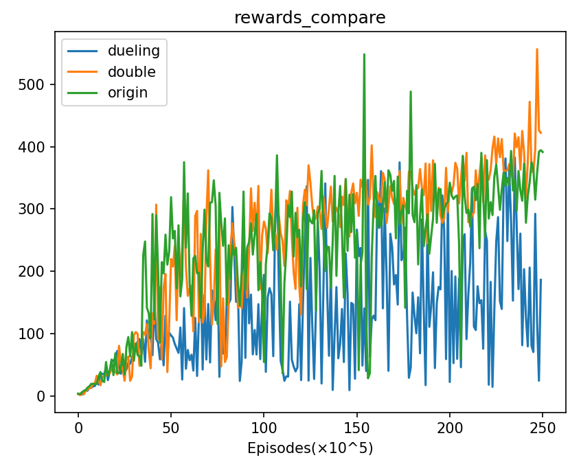

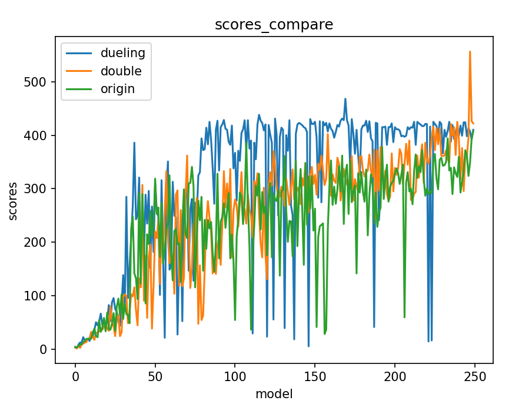

we can see that dueling not play so well in the reward.jpg, but it plays the best in the game. As the scores.jpg showing, it can win the game with more than one model and it can always get scores higher than 400. And the original code can often get scores higher than 300. And double dqn plays better than dqn. It can win the game and always get a higher score than dqn gets.


### Reference

[AdrianHsu/breakout-Deep-Q-Network: Reinforcement Learning | tensorflow implementation of DQN, Dueling DQN and Double DQN performed on Atari Breakout (github.com)](https://github.com/AdrianHsu/breakout-Deep-Q-Network) 

[torch.nn.init.kaiming_normal](https://blog.csdn.net/weixin_36670529/article/details/101776253)

[强化学习(十二) Dueling DQN - 刘建平Pinard - 博客园 (cnblogs.com)](https://www.cnblogs.com/pinard/p/9923859.html)

[【强化学习1】Dueling DQN - 知乎 (zhihu.com)](https://zhuanlan.zhihu.com/p/66069958)

[12 - Double DQN (joindeltaacademy.com)](https://tutorials.joindeltaacademy.com/12-double-dqn#a48c269077be437aa4aaa6a8545092fe)

[zeng798473532 (zeng798473532) - Gitee.com](https://gitee.com/zeng798473532)
